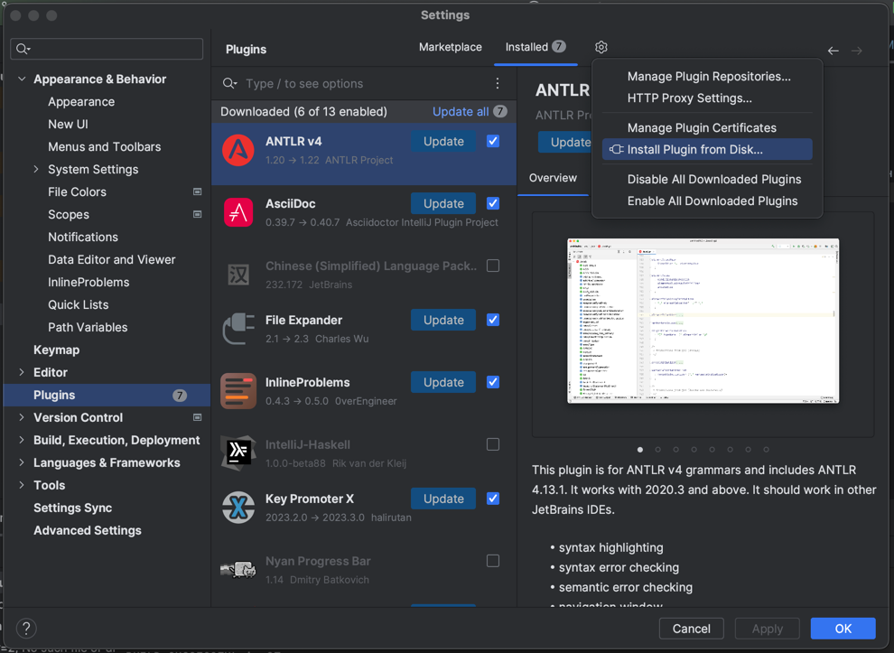
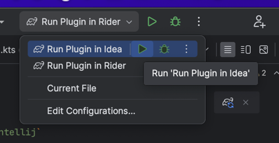

# ControlFunGraph

Плагин для IDE на базе платформы IntelliJ, который позволяет строить и исследовать Control flow graph исходного кода.

На данный момент поддержаны Kotlin, Rust, JavaScript и С#.

Для построения графа необходимо нажать ПКМ в любой точке необходимой функции и выбрать Show CFG. 
Затем при перемещении курсора внутри функции, на графе будет выделяться соответствующий узел.
Также есть возможность просмотреть все пути, которые ведут к выбранному в данный момент узлу из начала фукнкции

## Системные требования

1. Любая актуальная версия Windows, osx или дистрибутива Linux
2. IDE на основе IntelliJ Platform (IntelliJ Idea, PyCharm, WebStorm, PhpStorm, Rider, CLion, RubyMine
GoLand, RustRover) версии не ниже чем 2022.2
3. Для работы с C# необходимо установить 
[дополнительный компонент](https://github.com/ebukreev/ControlFunGraph/tree/master/binaries). Для этого необходимо
скачать его под нужную ОС и распаковать в:
   * Windows: `%APPDATA%/csharp-cfg/`
   * OSX: `~/csharp-cfg/`
   * Linux: `~/csharp-cfg/`

## Сборка проекта

1. Используйте команду `gradlew ControlFunGraph:control-fun-graph-intellij`
2. Артефакт сборки будет находиться в `control-fun-graph-intellij/build/distribution`. Его можно установить в любую
IDE, соответствующую системным требованиям. Это можно сделать в настройках IDE:



## Запуск тесовой IDE

Если не хочется устанавливать плагин в IDE, можно запустить тестовую IDE, которая уже будет уже с необходимым набором
плагинов.

Запускайте Rider для использования плагина в C# и Idea для всех других поддерживаемых языков — плагины для них
уже будут установлены.

1. Запуск из IDE



2. Запуск из терминала

```shell
cfg_ide_type=idea && ./gradlew ControlFunGraph:runIde
```
```shell
cfg_ide_type=rider && ./gradlew ControlFunGraph:runIde
```
